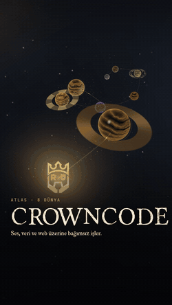

# CrownCode

Hasan Arthur Altuntaş's workshop for independent software projects, built as a
Computer Engineering thesis at Düzce University. The site is live at
[hasan-arthur-altuntas.xyz](https://hasan-arthur-altuntas.xyz).

<table>
  <tr>
    <td align="center" width="50%">
      
    </td>
    <td align="center" width="50%">
      
    </td>
  </tr>
  <tr>
    <td align="center"><sub>The homepage: every project is a world on one route.</sub></td>
    <td align="center"><sub>AURIS, the AI music detector. <a href="docs/AURIS.md">Its own guide →</a></sub></td>
  </tr>
</table>

---

## Contents

- [The projects](#the-projects)
- [How CrownCode is put together](#how-crowncode-is-put-together)
  - [The map](#the-map)
  - [Repositories](#repositories)
  - [The platform](#the-platform)
  - [The homepage atlas](#the-homepage-atlas)
  - [Search engines and sharing](#search-engines-and-sharing)
  - [Hosting](#hosting)
  - [The backend](#the-backend)
  - [Checks and CI](#checks-and-ci)
  - [Scripts](#scripts)
- [Running it locally](#running-it-locally)
- [AURIS](#auris)
- [More documentation](#more-documentation)
- [License and citation](#license-and-citation)

## The projects

Each project has its own page on the site. The status column is the one the
site itself shows.

| Project | Page | What it does | Status |
| --- | --- | --- | --- |
| **AURIS** | [/ai-music-detection](https://hasan-arthur-altuntas.xyz/ai-music-detection) | Estimates whether a song was made with AI: a LightGBM verdict, eleven models voting, SHAP explanations. | In development (thesis) |
| **ML Toolkit** | [/data-manipulation](https://hasan-arthur-altuntas.xyz/data-manipulation) | Tools for audio datasets: format conversion, pitch/speed/noise augmentation, tag extraction. | Experimental |
| **Crown Fortune** | [/crown-fortune](https://hasan-arthur-altuntas.xyz/crown-fortune) | A fortune wheel and a 22-card deck that reset at midnight. | Active |
| **Crown Dreams** | [/crown-dreams](https://hasan-arthur-altuntas.xyz/crown-dreams) | Reads the emotions, themes and symbols of a written dream with Gemini. | Active |
| **Crown Commend** | [/crown-commend](https://hasan-arthur-altuntas.xyz/crown-commend) | Drafts a YouTube comment from what the video covers. | Active |
| **Crown Vote (VOTRYX)** | [/crown-vote](https://hasan-arthur-altuntas.xyz/crown-vote) | A Windows app that votes on DistroKid Spotlight through Chrome. | Active |
| **Noir & Grain** | [/noir-grain](https://hasan-arthur-altuntas.xyz/noir-grain) | A fine-dining restaurant template with WebGL ink transitions. | Active |
| **Kognita** | [GitHub](https://github.com/Rtur2003/Kognita) | A desktop tracker that keeps everything it records on your machine. | On GitHub |

## How CrownCode is put together

### The map

```
 visitor
    │
    ▼
 Cloudflare Worker ── hasan-arthur-altuntas.xyz
 (Next.js 16 through OpenNext, images through the IMAGES binding)
    │  pages, API routes (/api/health, /api/vitals, …), static assets
    │
    │  AURIS requests go straight from the browser to:
    ▼
 Hugging Face Space ── Rthur2003/crowncode-backend
 (FastAPI in Docker, 2 vCPU)
    │  job queue → one decode → feature, vocal, wav2vec2, CLAP layers
    │  → LightGBM verdict, 11-model vote, SHAP → meta-classifier
    │
    ├──► model weights, baked into the image at build time
    │    from Hugging Face ── Rthur2003/auris-models
    └──► FST comparison model, called over the network
         Hugging Face ── mippia/AI-Music-Detection-FST
```

The website and the analysis server are deployed separately and meet only over
HTTPS. The browser talks to the Space directly (CORS allows the site's origin),
so a slow analysis never ties up the web server.

### Repositories

| Where | What | Tracked here |
| --- | --- | --- |
| `platform/` | The Next.js site: every page, the atlas, AURIS's interface. | yes |
| `backend/` | The first FastAPI service (signal measurements and YouTube download). Kept for reference; production runs from the Space below. | yes |
| `hf-crowncode-backend/` | The production backend. It is its own git repository whose remote **is** the Space: a push to it is a deploy. | no (`.gitignore`) |
| `DataSet/` | AURIS training audio and feature tables (5,195 labelled songs). Too large for git; lives on the author's disk. | no |
| `docs/` | Academic reports, technical notes, guides, and the media used in this README. | yes |
| `portfolio/`, `templates/`, `scripts/` | A Vite portfolio, page templates, repository-level tooling. | yes |
| `Android-App-CrownCode/` | The Android client. | no |

### The platform

`platform/` is a **Next.js 16** app on the Pages Router with **React 19** and
TypeScript.

- **Content comes from one place.** `config/product-catalog.ts` lists the
  projects, their routes and their locale keys. The homepage, the search, the
  footer and the sitemap all read it, so adding a project there puts it
  everywhere at once.
- **Two languages on real URLs.** Turkish is the default (`/crown-fortune`),
  English lives under `/en` (`/en/crown-fortune`). Next's i18n routing sets
  the locale; `context/LanguageContext.tsx` serves the strings from
  `locales/tr.json` and `locales/en.json`, and CI fails if the two files stop
  having the same keys.
- **Styling** is CSS Modules on top of the tokens in
  `styles/base/variables.css`: one warm dark palette, IM Fell for text,
  Portmanteau for display type, JetBrains Mono for data. The fonts are
  self-hosted through `next/font/local` (`styles/fonts.ts`). Portmanteau had
  no ı, İ, ş, ğ, so `scripts/add-turkish-glyphs.py` builds them from the
  font's own shapes.
- **Motion** uses `motion` 12 through `LazyMotion`, so the animation code
  loads after the page is interactive. Everything honours
  `prefers-reduced-motion`.
- **3D** is `three` with `@react-three/fiber`, loaded only on the pages that
  draw a world (the homepage and AURIS) and never on the server.
- **Offline**: `public/sw.js` serves pages network-first with an offline
  fallback and caches the hashed build files.

### The homepage atlas

The homepage is one WebGL scene: each project is a world on a gold route that
winds into the distance, and scrolling flies the camera from world to world,
the way a game shows its level select. The pieces:

- `components/Home/Atlas/AtlasScene.tsx` and `shaders.ts`: the planets,
  atmospheres, rings and route are procedural shaders, so there are no planet
  textures to download and a world stays sharp however close the camera gets.
- `config/showroom-worlds.ts`: how each world looks (surface colours,
  banding, engraved contour lines, ring style) and where it sits on the
  route. A project without a hand-made look gets a stable one derived from
  its id, so a new catalog entry simply becomes the next world.
- `components/Home/ProjectExplorer.tsx`: the scroll track, the level-select
  strip and the project log that rises over the finished journey.
- The server HTML carries a rendered still of the scene, so the first paint
  is the atlas even before WebGL starts. With reduced motion the flight is
  replaced by the still and the full list.

### Search engines and sharing

- Every page gets its canonical URL, `hreflang` alternates for both
  languages, and one JSON-LD graph (`WebSite`, `Person`, `WebPage`,
  breadcrumbs, and a `WebApplication` for project pages). Settings live in
  `config/site.ts`; `components/Layout/MainLayout.tsx` writes the tags.
- `pages/sitemap.xml.ts` builds the sitemap from the catalog with both
  language versions of each URL. Personal or diagnostic pages
  (`/analysis-history`, `/system-status`, `/search`) are `noindex`.
- Share images are rendered from the real scene by scripts, not drawn by
  hand: `scripts/generate-og-images.mjs` for the site, and AURIS has its own
  per-language image.

### Hosting

Production runs on **Cloudflare Workers** through
[`@opennextjs/cloudflare`](https://opennext.js.org/cloudflare):

```bash
cd platform
npm run preview   # build for Workers and run it locally
npm run deploy    # build and deploy
```

`platform/wrangler.jsonc` binds the static assets and Cloudflare Images (without
the `IMAGES` binding, `next/image` would serve originals). Security headers and
cache rules are set in `platform/next.config.js` and `platform/public/_headers`.
The root `netlify.toml` is the earlier Netlify setup and is no longer what
serves the site.

### The backend

The AURIS server is a FastAPI app in a Docker Space on Hugging Face
(`cpu-basic`: 2 vCPU, 16 GB). Its repository is `hf-crowncode-backend/`, and
pushing it rebuilds the Space.

- **Model weights are baked into the image.** The Docker build downloads
  them from [`Rthur2003/auris-models`](https://huggingface.co/Rthur2003/auris-models)
  once; a Space waking from sleep finds them on disk instead of fetching
  ~415 MB again.
- **Warm-up.** Right after start the server runs every model once on a
  synthetic signal, so librosa's compiled code and wav2vec2 are ready before
  the first visitor.
- **One analysis at a time, fairly.** Two cores are fully used by one
  analysis, so jobs wait in a first-come queue and each visitor sees their
  place in it. Network waits (YouTube download, the external FST model) happen
  outside the queue slot. Up to 24 jobs can wait; beyond that the API answers
  `503` with `Retry-After`.
- **Abandoned work is dropped.** A job belongs to whoever polls it. If
  nobody has polled for three minutes when its turn comes, the tab was closed
  and the job is skipped. A reloaded page resumes the same job instead of
  uploading again.
- **Same file, same answer.** Identical uploads share one job while it runs,
  and finished results are cached for six hours by content hash.
- `GET /api/health` reports what is actually loaded (the LightGBM model, how
  many of the 11 voters, SHAP, wav2vec2, the meta-classifier), whether the
  warm-up has finished, and how many jobs are running and waiting.

The full API, the models and their numbers are in [docs/AURIS.md](docs/AURIS.md).

### Checks and CI

| Check | Where | Command |
| --- | --- | --- |
| Types | platform | `npm run type-check` |
| Lint (ESLint 9 flat config, React Compiler rules) | platform | `npm run lint` |
| Unit and page tests (Jest, Testing Library) | platform | `npm test` |
| Turkish/English key parity | platform | `npm run i18n:check` |
| Backend tests (pytest, no model inference) | hf-crowncode-backend | `python -m pytest --no-cov -k "not real_audio and not bad_audio"` |

GitHub Actions (`.github/workflows/`) runs on the `geliştirme` branch and its
pull requests:

- `ci.yml`: type check, lint and locale parity; a server build and a static
  export build; tests on Node 24 as an early warning.
- `engineering-standards.yml`: branch names, Conventional Commit messages and
  commit size.

### Scripts

Everything visual that isn't code is generated from the running site, so it
never drifts from what visitors see.

| Script (`platform/scripts/`) | Makes |
| --- | --- |
| `generate-og-images.mjs` | Share images for every page, from the atlas scene |
| `capture-atlas-assets.py`, `generate-atlas-textures.py` | The atlas poster stills and textures |
| `capture-atlas-reel.mjs`, `generate-reel-soundtrack.py` | The 9:16 atlas reel and its soundtrack |
| `capture-auris-reel.py`, `generate-auris-reel-sound.py` | The 9:16 AURIS reel (demo data) and its sound |
| `add-turkish-glyphs.py` | The Turkish letters in the display font |
| `check-locale-parity.mjs` | The locale check CI runs |

Reel frames are written to the system temp folder and deleted once the video
is encoded; videos land in `platform/assets-src/video/`, which git ignores.

## Running it locally

You need Node 20.18 or newer (24 LTS recommended).

```bash
git clone https://github.com/Rtur2003/CrownCode.git
cd CrownCode/platform
npm install
npm run dev          # http://localhost:3000
```

AURIS talks to the public Space by default. To use a backend on your own
machine instead, set `NEXT_PUBLIC_API_URL=http://localhost:7860` in
`platform/.env.local` (see `platform/.env.example`).

## AURIS

AURIS has its own guide: **[docs/AURIS.md](docs/AURIS.md)**. It covers what a
visitor sees, how an analysis runs from upload to verdict, the job API, the
models with their cross-validated numbers, the training data, and what the
system can't do.

## More documentation

- Academic: [English report](docs/academic/ACADEMIC_PROJECT_REPORT_EN.md) ·
  [Türkçe rapor](docs/academic/AKADEMIK_PROJE_RAPORU_TR.md) ·
  [Thesis summary](docs/academic/THESIS_SUMMARY.md)
- Technical: [AI model strategy](docs/technical/AI_MODEL_STRATEGY.md) ·
  [Backend contract](docs/BACKEND_CONTRACT.md) ·
  [Troubleshooting](docs/TROUBLESHOOTING.md)
- Working on the code: [Quick start](docs/QUICK_START.md) ·
  [Development guidelines](docs/DEVELOPMENT_GUIDELINES.md) ·
  [Branch naming](docs/BRANCH_NAMING.md) · [Commit messages](docs/COMMIT_MESSAGES.md) ·
  [Contributing](CONTRIBUTING.md) · [Changelog](docs/CHANGELOG.md)

## License and citation

MIT, see [LICENSE](LICENSE).

```bibtex
@thesis{altuntas2026crowncode,
  title       = {Web-Based AI Music Detection and Data Manipulation Platform},
  author      = {Hasan Arthur Altuntaş},
  institution = {Düzce University},
  department  = {Computer Engineering},
  year        = {2026},
  type        = {Bachelor's Thesis},
  url         = {https://hasan-arthur-altuntas.xyz}
}
```

GitHub [@Rtur2003](https://github.com/Rtur2003) ·
[hasan-arthur-altuntas.xyz](https://hasan-arthur-altuntas.xyz) ·
contact@hasan-arthur-altuntas.xyz
