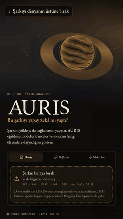

# AURIS

AURIS estimates whether a song was made with AI and shows what that estimate
rests on. You give it a file, a YouTube link or a microphone take; it answers
with a probability, where that probability sits against the decision
threshold, what eleven models said, and which measurements pushed the result
which way.

<p align="center">
  
</p>

**Try it:** [hasan-arthur-altuntas.xyz/ai-music-detection](https://hasan-arthur-altuntas.xyz/ai-music-detection) ·
**Model weights:** [Rthur2003/auris-models](https://huggingface.co/Rthur2003/auris-models) ·
**Server:** [Rthur2003/crowncode-backend](https://huggingface.co/spaces/Rthur2003/crowncode-backend)

This is the AURIS half of the [CrownCode](../README.md) repository. It is still
being developed: read every result as a likelihood, not a ruling.

---

## Contents

- [What a visitor sees](#what-a-visitor-sees)
- [From upload to verdict](#from-upload-to-verdict)
- [The models](#the-models)
- [Training data](#training-data)
- [When many people use it at once](#when-many-people-use-it-at-once)
- [API](#api)
- [Code map](#code-map)
- [Running and deploying](#running-and-deploying)
- [What it can't do](#what-it-cant-do)

## What a visitor sees

The page opens on the AURIS world from the homepage atlas, the same
procedural planet with its vinyl ring. A song can be dropped anywhere on it.

1. **Waiting.** The band just outside the ring is the progress bar. It
   sweeps while the server wakes up or while the job waits in line, then
   fills one segment per real step: the upload, then each model finishing on
   the server. The panel lists those steps with the seconds each one took, and
   says how many analyses are ahead when there is a queue.
2. **The result.** The world takes the verdict's colour (amber for AI, green
   for human) and the band shows the probability with the threshold marked on
   it. The panel gives the probability, the certainty tier, and how many of the
   eleven models agree.
3. **The report** hangs off the atlas's gold route below: the waveform and
   spectrogram, the eleven votes, the features that moved the verdict most
   (SHAP), feature families, the independent layers, the meta-classifier's
   second opinion, vocal measurements, and anything the server couldn't run.
4. **Sharing.** "Share the result" draws a portrait card of the verdict and
   opens the phone's share sheet, or downloads the card on desktop.

The analysis doesn't belong to the page. It keeps running while the visitor
browses other pages (a small pill in the corner links back), a reload picks the
same server job up instead of uploading again, and the last result and its
audio stay in the browser so they are still there next time.

If the server can't produce a model result, the page says so in plain words
and falls back to seven signal measurements taken in the browser, clearly
labelled as not being the trained model.

## From upload to verdict

```
browser                                   Hugging Face Space (FastAPI)
───────                                   ────────────────────────────
decode + measure locally ─┐
(waveform, spectrogram)   │
                          │   POST /api/analyze/jobs  ──►  validate, hash the file
upload with progress ─────┴─────────────────────────────►  same file running? share that job
                                                           cached result? answer at once
poll GET /api/analyze/jobs/{id}  ◄──── queue position ───  wait for the CPU slot (FIFO)
                                                           │
                                                           ├─ decode once: first 60 s, mono, 22.05 kHz
                                                           ├─ in parallel: 47 features · vocal analysis
                                                           │               wav2vec2 · CLAP layer
                                                           ├─ whole-track scan: first 6 min in ~30 s windows
                                                           ├─ at the same time, over the network: FST
                                                           ├─ LightGBM verdict + 10 more votes + SHAP
                                                           └─ meta-classifier (second opinion)
steps tick as they finish  ◄──── per-step state ──────────
report  ◄──────────────────────── result ─────────────────
```

The audio is decoded once and every layer reads that same clip. Loading the
clip back returns exactly the samples the feature extractor would have got
from the original file, so this saves three decodes without changing a single
feature value.

A YouTube link takes the same road after the server downloads the first six
minutes of its audio (from `?t=` if the link has one).

### The whole-track scan

The verdict comes from the opening clip, as validated. Alongside it the server
reads the rest of the track (`app/services/timeline.py`): the first six minutes
are cut into equal windows of about 30 s (20 to 45 s each), and every window
goes through the same feature extraction, vocal analysis and LightGBM model.
Beat counts are scaled to the 60 s the model was trained on, and SHAP gives each
window its top three reasons. Two windows run at once, and windows not started
within 180 s are reported as skipped instead of holding the CPU slot longer.
The result carries `timeline` with a peak envelope for the waveform, one
segment per window, and a summary. The page draws it under the waveform.

A window score is the classifier applied to an excerpt shorter than its 60 s
training clips, and every training clip was wholly AI or wholly human. The
timeline shows where the music reads AI-like, not where an AI was used, and it
does not change the verdict.

## The models

**The verdict** comes from one LightGBM classifier on 47 audio features
(spectral, temporal, harmonic, rhythm, timbre and vocal). Its probability is
compared with a threshold of **0.431577**, the point where Youden's J peaked in
cross-validation; at or above it the song is called AI. The certainty tier
("Uncertain" to "Very strong") is measured from that threshold, not from 0.5.

Cross-validated results (5 folds, 5,195 songs), from `training_results.json`
in the model repository:

| | Accuracy | Precision | Recall | F1 | ROC-AUC |
| --- | --- | --- | --- | --- | --- |
| LightGBM (the verdict) | 0.8839 | 0.8441 | 0.8713 | 0.8575 | 0.9549 |

**The vote.** Ten more models trained on the same features are run on every
song and shown next to the verdict. They don't decide anything; they show
whether the verdict is a lone call or a consensus.

| Model | ROC-AUC |
| --- | --- |
| LightGBM | 0.9549 |
| Deep MLP (512-256-128-64) | 0.9537 |
| XGBoost | 0.9463 |
| Residual MLP (3 blocks) | 0.9453 |
| Gradient Boosting | 0.9406 |
| Random Forest | 0.9393 |
| Attention MLP | 0.9356 |
| SVM (RBF) | 0.9347 |
| MLP Neural Network | 0.9258 |
| Logistic Regression | 0.8511 |
| 1D-CNN | 0.8442 |

If a model file fails to load, its row says so (`available: false`) instead of
showing a made-up probability.

**Why.** SHAP (TreeExplainer on the LightGBM model) gives each feature's push
towards AI or human for this particular song. The report shows the strongest
ones with their raw value and how far that value is from the training average
(z-score), and sums all 47 by family.

**Independent layers.** These run beside the verdict and are reported on their
own:

| Layer | What it is |
| --- | --- |
| wav2vec2 | A wav2vec2-base model fine-tuned by AURIS on raw audio (first 30 s). |
| Vocal analysis | Rule-based pitch, vibrato, formant and breath measurements. |
| CLAP | Audio embedding layer. The CLAP library isn't installed on the Space (it pins numpy below 2, and the model files need numpy 2), so this layer runs its spectral fallback and the report says so. |
| FST | The open-source detector published by the mippia team, called on their Hugging Face Space. The file is sent there for this layer. |
| Meta-classifier | A stacking model trained on cross-validated layer outputs. Shown as a second opinion; it never changes the verdict. |

## Training data

5,195 songs, 2,082 AI-made and 3,113 made by people, from the table the model
was trained on (`DataSet/features_with_meta.csv`):

| Source | AI | Human |
| --- | --- | --- |
| Echoes (AudioLDM 587, ACE-Step 294, Brev 218, DiffRhythm 29) | 1,128 | |
| Free Music Archive | | 1,000 |
| GTZAN (10 genres) | | 999 |
| SleepyJesse/ai_music_large | | 854 |
| Suno (suno-audio) | 500 | |
| AIME (Udio 83, MusicGen 83, others) | 204 | |
| Vocal deepfake sets | 250 | 242 |
| archive.org | | 18 |

Audio features are extracted from 60-second clips at 22.05 kHz. Two
columns (duration and sample rate) were dropped before training because they
leaked the source, and the scaler is fitted inside each fold.

## When many people use it at once

The Space has two virtual CPUs and one analysis already keeps both busy. So:

- Jobs take the CPU **one at a time, first come first served**
  (`AURIS_CPU_SLOTS=1`). Everyone else waits in line and sees their place and,
  once the server has timed a job, an estimate of the wait.
- The **download and the FST call don't hold the slot**: they are network
  waits, so the next song can use the CPU meanwhile.
- **Ten people at once** get ten places in line; the tenth waits for nine
  analyses. There is room for 24 waiting jobs (`AURIS_MAX_PENDING`); the 25th
  gets `503` with `Retry-After: 30` and the page says the server is busy.
- **Leaving the page** in the same tab changes nothing: the job keeps running
  and the result waits. **Closing the tab** stops the polling; if the job was
  still waiting in line three minutes later, it is dropped when its turn
  comes, so nobody's CPU time goes to an empty room. **Cancel** tells the
  server directly: a waiting job leaves the line, a running one stops at the
  next step.
- **The same file twice** (two tabs, a double click, a friend with the same
  song) shares one job while it runs, and a finished result is kept for six
  hours by content hash.
- Each IP can start 20 analyses a minute. Polling is not counted.

## API

Base URL: `https://rthur2003-crowncode-backend.hf.space`

| Method | Path | |
| --- | --- | --- |
| `POST` | `/api/analyze/jobs` | Start an analysis (form fields below). `202` with the job, or `200` with an immediate error. |
| `GET` | `/api/analyze/jobs/{jobId}` | The job's state; polling it also keeps a queued job alive. |
| `DELETE` | `/api/analyze/jobs/{jobId}` | Cancel. |
| `POST` | `/api/analyze` | The same analysis in one request that waits for the result (same queue). |
| `GET` | `/api/health` | What is loaded, warm-up state, running and waiting jobs. |

Form fields: `sourceType` (`file` or `youtube`), and `file` (up to 30 MB) or
`url`.

A job while it waits:

```json
{
  "jobId": "4f0c…",
  "status": "running",
  "phase": "queued",
  "queue": { "position": 2, "ahead": 2, "estimatedWaitSec": 70.0 },
  "steps": [{ "id": "features", "state": "pending" }, "…"],
  "elapsedSec": 12.4,
  "response": null
}
```

`status` stays `running` until the job is `done` or `error`, so older clients
keep polling; `phase` tells waiting (`queued`) from working (`running`). Steps
are `features`, `vocals`, `wav2vec2`, `clap`, `fst`, `xai`, `meta` (plus
`download` for links), each `pending`, `running`, `done`, `skipped` or
`failed`, with `seconds` once finished. When the job settles, `response` holds
`{ result, warnings, errors }`; `result.xai` carries the probability,
threshold, votes and SHAP contributions, and `result.layers` says which
implementation each layer used.

Error codes: `missing_file`, `missing_url`, `invalid_file_type`,
`file_too_large`, `file_too_small`, `invalid_youtube_url`,
`youtube_authentication_required`, `youtube_analysis_failed`,
`audio_too_short`, `audio_silent`, `audio_decode_failed`, `cancelled`,
`job_abandoned`, `internal_error`. A full queue is HTTP `503`
(`server_busy`), too many requests from one address is `429`.

## Code map

**Server** (`hf-crowncode-backend/`, its own repository; a push deploys the Space)

| File | |
| --- | --- |
| `app/routes/analyze.py` | The endpoints, the pipeline, the warm-up. |
| `app/services/analysis_jobs.py` | The queue (`CpuGate`), jobs, cancellation, the result cache. |
| `app/services/feature_extractor.py` | The 47 features and `decode_clip`. |
| `app/services/inference_xai.py` | LightGBM verdict, the eleven votes, SHAP, certainty tiers. |
| `app/services/fst_client.py` | The FST call (bounded, retried after a cool-down, temp files removed). |
| `app/routes/health.py` | The model and queue report. |
| `Dockerfile`, `startup.py` | Image build; weights baked in from the model repository. |

**Site** (`platform/`)

| File | |
| --- | --- |
| `pages/ai-music-detection/index.tsx` | The page: the stage, the panel states, the route below. |
| `components/Auris/AurisWorld.tsx` | The WebGL world and the progress band (shares the atlas shaders). |
| `components/Auris/Report.tsx`, `JobProgress.tsx` | The verdict, the report, the waiting panel. |
| `components/Auris/shareCard.ts` | The shareable result card. |
| `hooks/auris/runner.ts`, `store.ts`, `persist.ts` | Jobs outside React: polling, resume after reload, IndexedDB. |
| `hooks/auris/signal.ts` | The seven browser-side measurements and the visuals. |
| `hooks/analysisGateway.ts` | Requests: upload with progress, job start, polling, cancel. |
| `config/api.ts`, `config/auris-model.ts` | The server address; the model's published numbers. |

## Running and deploying

The site uses the public Space unless `NEXT_PUBLIC_API_URL` says otherwise.

Server settings (Space variables, all optional):

| Variable | Default | |
| --- | --- | --- |
| `AURIS_CPU_SLOTS` | `1` | Analyses that may use the CPU at once. |
| `AURIS_MAX_PENDING` | `24` | Waiting plus running jobs before new ones get `503`. |
| `AURIS_WARMUP` | `1` in the image | Run every model once at start. |
| `FST_ENABLED` | `1` | Set `0` to stop sending audio to the FST Space. |
| `FST_PREDICT_TIMEOUT` | `60` | Seconds to wait for FST. |
| `CROWNCODE_CORS_ORIGINS` | | Allowed site origins, comma separated. |

YouTube sometimes blocks downloads from cloud addresses. When that happens, add
exported YouTube cookies as the Space secret `YOUTUBE_COOKIES_BASE64` (base64 of
a cookies.txt file); `YOUTUBE_COOKIES_FILE` works for a path inside the image.

The tests don't run any model:

```bash
cd hf-crowncode-backend
python -m pytest --no-cov -k "not real_audio and not bad_audio"
```

`tests/test_analyze_queue.py` sends ten uploads at once through the real
endpoints with the analysis stubbed out, and checks the queue order, a cancel
and a shared upload.

## What it can't do

- It knows the generators and genres in its training data. A new generator,
  or a new version of Suno or Udio, can fool it.
- Heavily processed or fully electronic songs made by people can look AI-made.
  Microphone takes and low-bitrate files distort the features.
- Accuracy is 88.4%: roughly one song in nine is misclassified. A probability
  close to the threshold means the model isn't sure.
- The FST layer sends the audio to a third party's Space. Turn it off with
  `FST_ENABLED=0` if that matters for your use.
